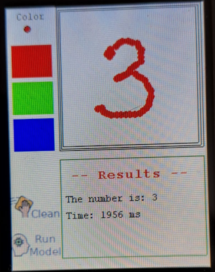

# Handwritten number recognition: a TinyML application using TFLM

Tried the project done by [Reymor](https://github.com/reymor/stm32f429-tflite-micro-mnist
)

A Work in progress!
=======
### Model in 2020 without CMSIS-NN

[model_running.webm](https://github.com/reymor/stm32f429-tflite-micro-mnist/assets/39070043/ee4e4d3d-7cc5-4812-ba92-d57546da7d25)

## Model

The model was trained in this [Colab](https://colab.research.google.com/drive/1VplKYj2p9_9LHHPtLSMRfFzcTP--8NoM?usp=sharing)

## Author

rmknan

